# UrbanLung: COPD Prevalence Estimation from Google Satellite Imagery and NHS Records

A multimodal machine learning pipeline that predicts COPD prevalence across 159 West Yorkshire GP practices using Google satellite imagery, environmental data and NHS records spanning 2019 to 2024 (791 practice-year observations), identifying under-diagnosed practices and estimating COPD burden for new GP practices without historical registers.

---

## Motivation

COPD affects an estimated 1.2 million diagnosed patients in England, with a further 2 million cases believed to remain unrecorded (Nacul et al., 2011). GP-level burden estimation has not advanced beyond survey-derived demographic models dependent on Health Survey for England spirometry data, a resource unavailable for new, reorganised, or data-sparse practices (NHS RightCare, 2018). National frameworks including QOF, NHS RightCare, and GIRFT have repeatedly highlighted this gap. Without practice-specific estimates, targeted case-finding cannot be prioritised, and late diagnosis continues to underpin the UK's poor standing in Europe for years of life lost from COPD (European Respiratory Society, 2013).

Long-term exposure to PM2.5 and NO2 is independently associated with reduced lung function and elevated COPD prevalence in large UK cohort studies (Doiron et al., 2019). Low residential greenness has been linked to increased COPD risk across multiple epidemiological analyses (Tsao et al., 2018). These exposures vary sharply across GP practice catchments in ways that demographic models cannot capture, yet no existing burden-estimation framework incorporates them at practice resolution. Satellite remote sensing provides measurements of NO2, PM2.5, vegetation indices, and land-surface characteristics at fine spatial resolution across every practice catchment in England, without dependence on clinical or monitoring infrastructure (Drusch et al., 2012).

Prior work has linked satellite data to respiratory outcomes at city and county resolution (Zanobetti and Schwartz, 2009; Liu et al., 2022). ResNet-50 features extracted from satellite imagery have explained up to 64% of cancer prevalence variation at census-tract level across US cities (Bibault et al., 2020), establishing proof of concept for CNN-on-imagery disease prediction. No existing study, however, operates at GP practice resolution, combines imagery and scalar environmental indices as complementary inputs, evaluates generalisation to geographic units entirely unseen during training, or provides uncertainty intervals with a formal coverage guarantee. Individual-level risk factors, particularly smoking prevalence and occupational exposure history, remain unavailable at practice level (NHS RightCare, 2018), placing an inherent constraint on what any satellite-grounded model can explain.

UrbanLung addresses this through a multimodal stacking ensemble combining scalar environmental features with Sentinel-2 satellite image representations, evaluated under leave-one-out cross-validation across 159 West Yorkshire GP practices, with conformal prediction providing coverage-guaranteed uncertainty intervals, SHAP and GradCAM explaining decisions across both modalities, and clinical outputs translating predictions into under-diagnosis flags, environmental inequality scores, and pre-registration COPD risk estimates for NHS planning.

---

## Dataset

The dataset comprises 791 practice-year observations across 159 West Yorkshire NHS practices spanning four NHS commissioning areas: Bradford, Kirklees, Leeds, and Wakefield, covering five financial years 2019-20 to 2023-24. The primary outcome is COPD prevalence from the Quality and Outcomes Framework (QOF), published annually by NHS Digital as the ratio of registered patients on the practice COPD register to total list size. Prevalence ranged from 1.02% to 5.35% across the dataset, with a mean of 2.23% and standard deviation of 0.73%.

**Table 1: Data sources, variables, resolution and observation period.**

| Source | Variable | Resolution | Period |
|--------|----------|------------|--------|
| QOF / NHS Digital | COPD prevalence (%) | GP practice | 2019-2024 |
| Sentinel-2 (ESA/GEE) | RGB patches 224x224 | 10 m | Annual median |
| Sentinel-5P (ESA) | NO2 (umol/m2) | 3.5 km | 2019-2024 |
| MODIS (NASA/GEE) | NDVI, EVI, LST | 250 m-1 km | 2019-2024 |
| Sentinel-5P (ESA) | PM2.5 AOD proxy | 3.5 km | 2019-2024 |
| SRTM (NASA/GEE) | Elevation (m) | 30 m | Static |
| ONS Census 2021 | Population density | LSOA | Static |

All satellite and environmental features were extracted from Google Earth Engine and aggregated to practice level using patient-weighted LSOA mapping, weighting each LSOA by its registered patient count. This ensures features reflect the actual environmental exposure of the registered population rather than the geographic footprint of the practice catchment. Sentinel-2 patches were centred on the patient-weighted population centroid of each catchment and used annual median composites with cloud masking applied before aggregation.

One-year temporal lags were computed for NO2, NDVI, EVI, PM2.5, and population density, capturing cumulative exposure history relevant to COPD pathogenesis. A NO2 change feature and a binary COVID-19 indicator were additionally included. The 2019-20 year was excluded from lag-dependent models as no prior year was available, leaving 636 training and 155 test observations under the temporal split protocol.

**Figure 1: Geographic distribution of COPD burden across 159 West Yorkshire GP practices (2023-24).**


**Figure 2: COPD prevalence distribution and year-on-year trend by NHS area (2019-2024).**


**Figure 3: Area-wise comparison of COPD, NO2, NDVI and elevation across four NHS commissioning areas.**


---

## Models

Four model architectures were developed and evaluated for research purposes, each addressing a distinct question about the data and the modelling approach. Temporal split and leave-one-out cross-validation results are reported for all four. The stacking ensemble (M4) was selected as the deployed model on the basis of LOOCV performance. M1, M2, and M3 serve as research baselines, ablation components, and interpretability instruments rather than standalone predictors.

### M1 — Ridge Regression (Literature Baseline)

Ridge regression with NDVI and NO2 as sole predictors replicates the design of published environmental health studies that use satellite-derived spectral indices to predict respiratory outcomes at aggregate geographic units. Its purpose is not to perform well but to establish whether the two most widely used satellite environmental variables, in isolation and without non-linear modelling, are sufficient for GP practice-level generalisation. Regularisation strength was selected via four-fold temporal cross-validation across twenty log-spaced values. The best alpha of 298 produced near-constant predictions with a predicted variance of 0.004%, confirming that two scalar features are insufficient and motivating the richer feature engineering of M2.

**Figure 4: Ridge regression alpha search, predicted vs actual, and residual analysis.**

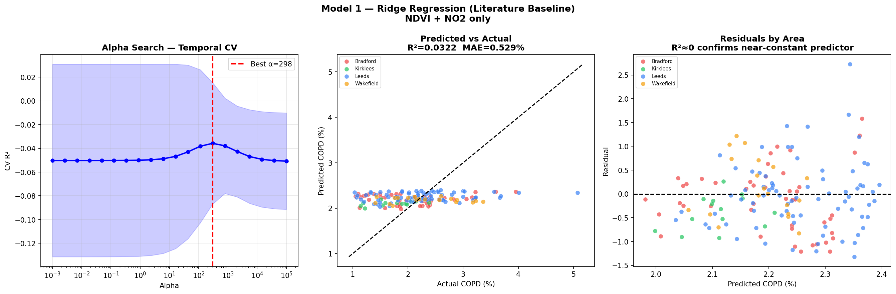

### M2 — XGBoost (Tabular Ceiling)

XGBoost was trained on fifteen tabular features spanning vegetation indices, air quality variables, land surface temperature, elevation, population density, image texture, temporal indicators, and one-year lags for key exposures. Its purpose is to establish the maximum predictive performance achievable from scalar environmental data alone, providing the tabular ceiling against which the marginal image contribution of M3 is measured. XGBoost was selected over linear models and neural tabular methods because it handles non-linear feature interactions natively, is robust to the small dataset size, and supports exact SHAP decomposition, which is used to attribute feature contributions to individual predictions and inform the clinical translation outputs.

**Figure 5: XGBoost SHAP feature importance, beeswarm plot, predicted vs actual, and SHAP dependence for the top feature.**

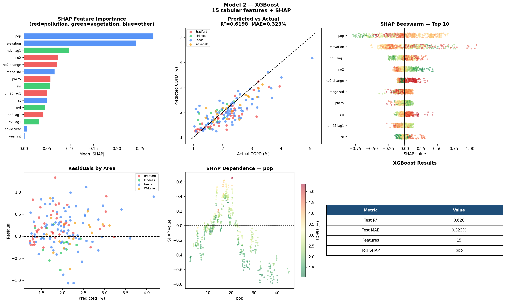

### M3 — SatResNet (Satellite Image CNN)

A ResNet-50 backbone pre-trained on 250,000 Sentinel-2 scenes via Momentum Contrast self-supervised learning (SENTINEL2_RGB_MOCO, accessed via torchgeo) was fine-tuned for COPD regression. Domain-specific pre-training was chosen over ImageNet initialisation because the spectral and geometric properties of Sentinel-2 overhead imagery differ fundamentally from natural photographs, and satellite-domain pre-training has been shown to outperform ImageNet on downstream earth observation tasks (Stewart et al., 2021). Two-phase transfer learning was employed: Phase 1 trained a three-layer regression head with the backbone frozen to establish a stable starting point; Phase 2 unfroze the two final residual blocks for spatial feature adaptation while preserving low-level Sentinel-2 representations. For leave-one-out evaluation, each fold loaded a fresh backbone to prevent leakage from practices in the test fold contributing to backbone representations. GradCAM and GradCAM++ were applied post-training to identify which image regions most influenced predictions, providing a spatial interpretability layer that scalar models cannot offer.

**Figure 6: GradCAM spatial attention maps for the five highest-COPD practices. Warm activation on road networks and building clusters.**

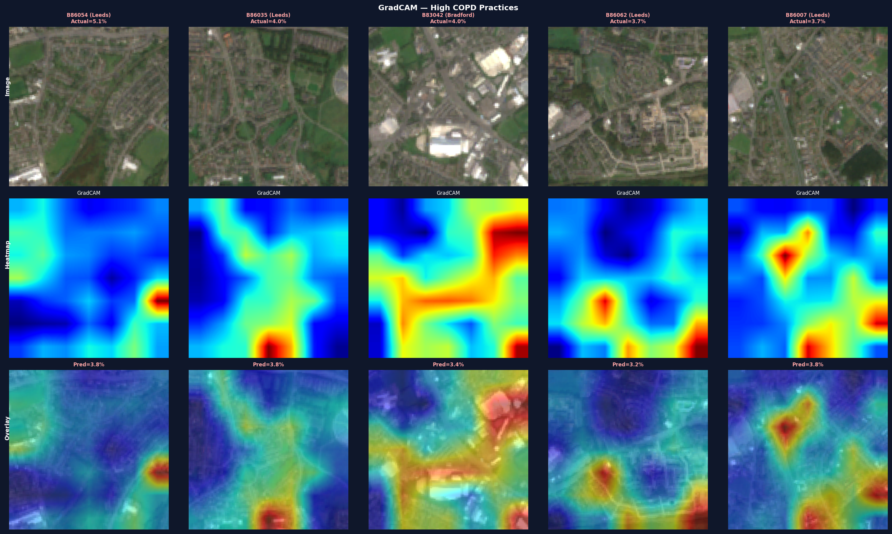

**Figure 7: GradCAM spatial attention maps for the five lowest-COPD practices. Warm activation on green space and agricultural land.**

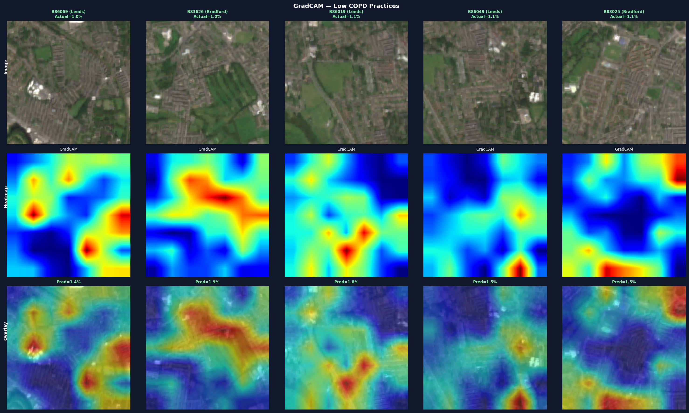

**Figure 8: GradCAM++ maps for highest-COPD practices, providing more localised activation than standard GradCAM.**

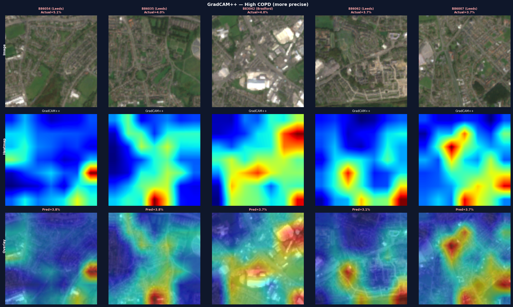

**Figure 9: Occlusion sensitivity analysis for highest-COPD practices, providing model-agnostic validation of GradCAM findings.**

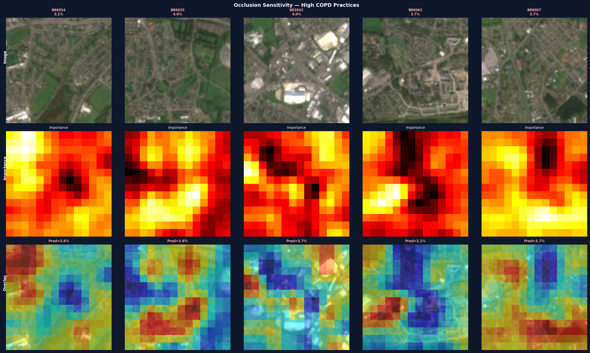

### M4 — Stacking Ensemble (Deployed Model)

The stacking ensemble combined out-of-fold predictions from M2 and M3 as inputs to a Ridge meta-learner. The out-of-fold design is critical: by training the meta-learner exclusively on predictions that the base models made without access to the target practice, no information about any practice enters the meta-learner's training set through that practice's own predictions. This prevents the target leakage that would arise from using in-sample fitted values. Simple averaging of base model predictions was rejected in favour of stacking because it assumes equal contribution from each modality, an assumption that is unlikely to hold when one model uses fifteen curated environmental features and the other uses raw image patches. The Ridge meta-learner was selected for its interpretability: the two fitted coefficients directly represent modality weights, providing a principled, data-driven answer to the question of how much satellite imagery contributes beyond tabular features. Meta-learner regularisation strength was selected by leave-one-out cross-validation over the aligned out-of-fold predictions.

**Figure 10: Stacking ensemble results showing OOF predictions for both base models, modality weight pie chart, and LOOCV comparison across all models.**

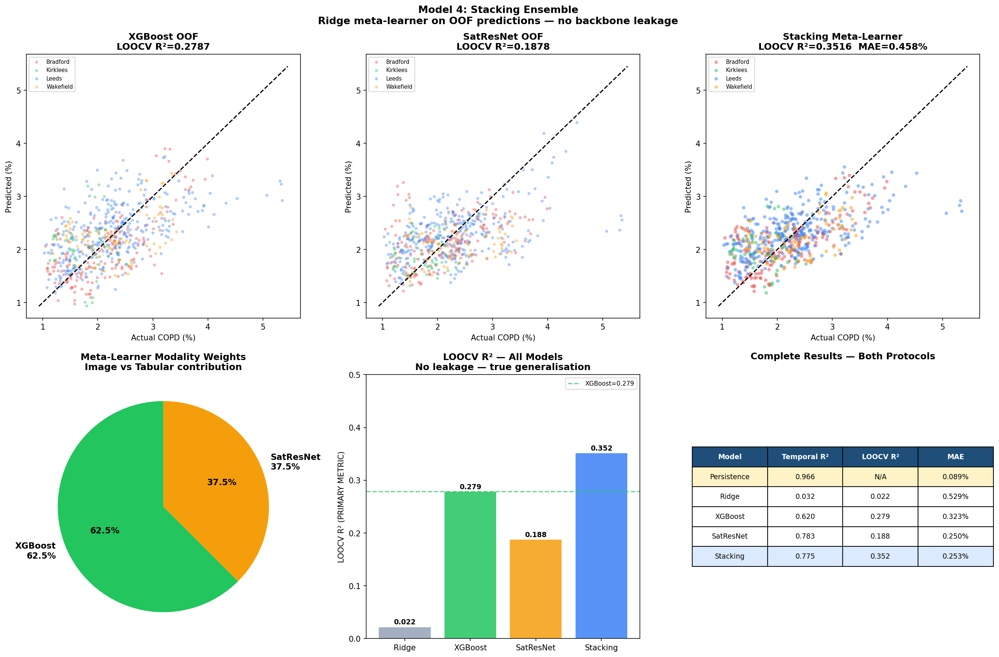

---

## Evaluation

Two evaluation protocols were applied to distinguish genuine environmental learning from memorisation of practice-level means. These address orthogonal questions: temporal evaluation asks how well a model tracks known practices over time, whereas leave-one-out cross-validation asks how well it generalises to practices it has never seen. Both are reported, but only LOOCV is informative for the intended application.

### Temporal Split

Models were trained on 2019-23 (636 observations) and evaluated on 2023-24 (155 observations). This reflects the approach used in prior satellite health modelling studies and approximates predicting the current year for practices with existing registers. A persistence baseline, predicting 2023-24 COPD as equal to 2022-23 COPD for each of the 159 practices, achieves R2=0.966 under this protocol. This is not a trained model but a one-line calculation that exploits within-practice register stability: the mean within-practice standard deviation across five years is 0.124%, compared to a between-practice standard deviation of 0.73%. Because the residual sum of squares is small relative to the total sum of squares by construction, any model that memorises practice-level means produces a similarly high temporal R2 regardless of whether it has learnt environmental relationships. Temporal R2 is therefore reported for comparability with prior literature only and is not interpreted as evidence of predictive utility.

### Leave-One-Out Cross-Validation (Primary Metric)

Each of the 159 practices was held out in turn. The model was trained on the remaining 158 practices across all years and predictions were generated for every observation of the held-out practice. No information about the held-out practice, its historical COPD values, geographic location, or environmental features, contributed to its prediction. To make this concrete: when predicting Bradford practice B83038, the model was trained exclusively on Leeds, Kirklees, Wakefield, and the remaining Bradford practices, forcing reliance on learnt environmental relationships rather than practice history. This directly simulates the target application of estimating COPD burden for a practice with no historical register data. A LOOCV R2 of zero would indicate that satellite features provide no information beyond the West Yorkshire mean; the achieved R2=0.352 indicates that 35% of between-practice COPD variance is explained by environmental signals alone, without access to any prior health records.

LOOCV was applied differently across models depending on computational feasibility. For Ridge (M1) and XGBoost (M2), true LOOCV was used, comprising 159 separate model fits. For SatResNet (M3), five-fold practice-stratified cross-validation was used as a computationally feasible approximation, with each fold loading a fresh SENTINEL2_RGB_MOCO backbone to prevent leakage. For the stacking ensemble (M4), LOOCV required no additional training as the meta-learner was trained directly on the out-of-fold predictions already computed during M2 and M3 evaluation.

**Figure 11: Persistence baseline motivation showing within-practice versus between-practice COPD variance and practice trajectories across five years.**


---

## Results

### Model Performance

**Table 2: Model performance under both evaluation protocols. LOOCV R2 is the primary metric.**

| Model | Temporal R2 | LOOCV R2 | MAE (%) | Notes |
|-------|-------------|----------|---------|-------|
| Persistence | 0.966 | -- | 0.089 | Location memorisation -- not a model |
| M1 Ridge (NDVI+NO2) | 0.032 | 0.022 | 0.529 | Literature baseline |
| M2 XGBoost | 0.620 | 0.279 | 0.323 | 15 tabular features |
| M3 SatResNet | 0.783 | 0.188 | 0.250 | Sentinel-2 image only |
| **M4 Stacking** | **0.775** | **0.352** | **0.253** | **Best model -- deployed** |

The persistence baseline's temporal R2=0.966 reflects within-practice register stability rather than predictive skill and is reported as a reference ceiling only. The Ridge model's LOOCV R2=0.022 confirms that NDVI and NO2 scalars alone are insufficient for practice-level generalisation. XGBoost establishes the tabular ceiling at LOOCV R2=0.279. SatResNet achieves LOOCV R2=0.188, below the tabular ceiling, which is expected given that scalar summaries of exposure distil information that requires years of epidemiological study to identify, whereas the image model must learn relevant spatial features from 159 practices alone. The stacking ensemble's LOOCV R2=0.352 exceeds both base learners, confirming complementary signal across modalities.

**Figure 12: Complete model comparison across temporal R2 and LOOCV R2, with improvement arrow from XGBoost to Stacking and full results table.**

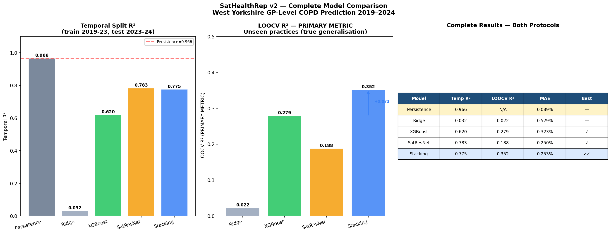

### Satellite Image Contribution

The meta-learner assigned 62.5% weight to XGBoost tabular predictions and 37.5% to SatResNet image predictions. The improvement over tabular alone is delta R2=+0.073 under LOOCV, confirming that Sentinel-2 RGB imagery provides genuinely complementary information beyond scalar environmental summaries. GradCAM analysis revealed that the image model concentrates attention on road networks, building clusters, and industrial infrastructure for the five highest-COPD test practices, and on green space and agricultural land for the five lowest-COPD practices. This pattern was confirmed by GradCAM++ and occlusion sensitivity, providing convergent evidence that the CNN attends to semantically meaningful environmental features.

### SHAP Feature Importance

**Table 3: SHAP feature importance on test set (XGBoost model). Combined pollution group: NO2 + NO2 lag + NO2 change + PM2.5 + PM2.5 lag = 0.146pp.**

| Rank | Feature | Mean SHAP | Interpretation |
|------|---------|-----------|----------------|
| 1 | Population density | 0.280 | Urban morphology; reflects demographics not just environment |
| 2 | Elevation | 0.229 | Valley trapping; low elevation = pollution accumulation |
| 3 | NDVI lag-1 | 0.079 | Cumulative green exposure prior year |
| 4 | EVI current | 0.057 | Enhanced vegetation; canopy structure |
| 5 | NDVI current | 0.050 | Current greenspace coverage |
| 6 | Image texture std | 0.047 | Urban density and road network heterogeneity |
| 7 | PM2.5 AOD | 0.043 | Particulate pollution |
| 11 | NO2 current | 0.028 | Traffic pollution; combined pollution group = 0.146pp |

Population density and elevation dominate prediction, reflecting structural geographic determinants of long-term cumulative exposure rather than contemporaneous pollution measurements. Historical vegetation outperforms current NDVI, consistent with cumulative rather than instantaneous green exposure driving respiratory outcomes. NO2 ranks eleventh individually but the combined pollution signal totals 0.146 percentage points, comparable to the elevation signal and constituting the third largest feature group.

### Uncertainty Quantification

**Table 4: Comparison of uncertainty quantification methods.**

| Method | CI Width | Empirical Coverage | Valid? |
|--------|----------|--------------------|--------|
| MC Dropout (100 passes) | +/-0.324% | 39.4% | No |
| Split conformal (n=50) | +/-1.007% | 92.7% | Near-valid |
| **LOO conformal (n=159)** | **+/-1.041%** | **95.6%** | **Yes** |

MC Dropout achieved only 39.4% empirical coverage, confirming that deep learning uncertainty estimates are poorly calibrated for this regression task at small sample size. LOO conformal prediction achieved 95.6% coverage with CI +/-1.041%, meeting the theoretical guarantee of at least 95% coverage for exchangeable data. Seven of 159 practices fall outside the conformal interval, consistent with the expected 5% non-coverage rate.

**Figure 13: LOO conformal prediction intervals across all 159 practices, coverage by area, and CI width distribution.**

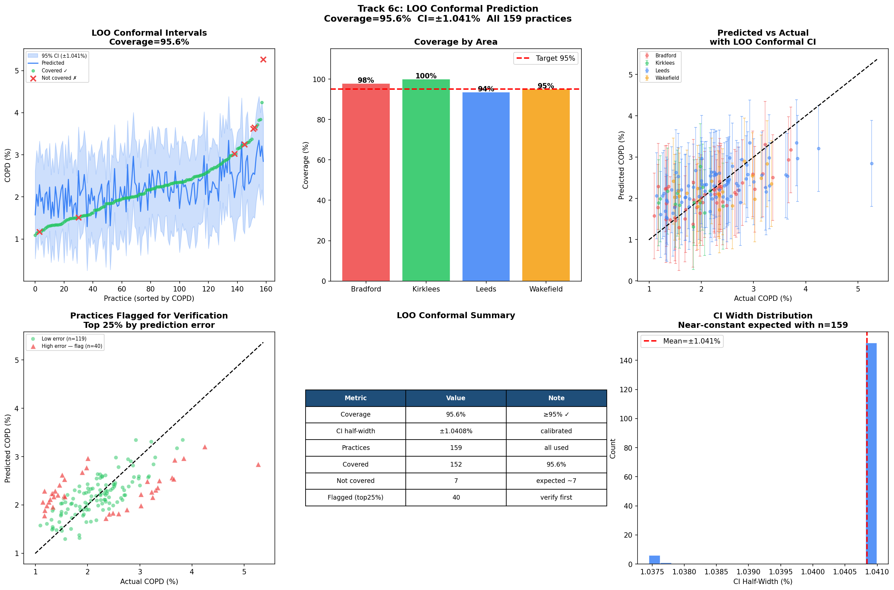

### Area-Level Findings

**Table 5: Area-level summary statistics (mean across 2019-2024). Burden score is a composite of NO2 rank (50%), inverse NDVI rank (30%), and COPD rank (20%).**

| NHS Area | Practices | COPD (%) | NO2 (umol/m2) | NDVI | Elevation (m) | Burden Score |
|----------|-----------|----------|----------------|------|---------------|--------------|
| Leeds | 62 | 2.32 | 106.4 | 0.539 | 92 | 0.613 |
| Wakefield | 31 | 2.34 | 101.5 | 0.606 | 184 | 0.433 |
| Bradford | 42 | 2.16 | 101.1 | 0.571 | 175 | 0.434 |
| Kirklees | 24 | 1.78 | 93.9 | 0.651 | 115 | 0.209 |

Leeds exhibits the highest composite environmental burden score of 0.613, driven by the highest NO2 concentrations in the region at 106.4 umol/m2 combined with the lowest mean NDVI of 0.539. The Wakefield anomaly is confirmed in residual analysis: Wakefield practices show the largest positive residuals, indicating that the satellite model systematically under-predicts COPD burden relative to registered prevalence. This is consistent with the industrial legacy of coal mining communities that persists in patient lung function decades after mine closure and represents a principled observational boundary of satellite-based modelling.

**Figure 14: Valley trapping effect showing elevation vs NO2 and elevation vs COPD scatter plots with regression lines.**


**Figure 15: Wakefield anomaly confirmed in residual analysis. Actual vs environment-predicted COPD with Wakefield practices highlighted.**


**Figure 16: COVID-19 lockdown signal. NO2 reduction of 8.2 umol/m2 in 2020-21 captured across all four NHS areas without input from health records.**


---

## Clinical Translation

Four actionable NHS outputs were derived from stacking ensemble predictions on the 2023-24 test year, each accompanied by LOO conformal uncertainty intervals.

**Table 6: Clinical translation outputs and NHS applications.**

| Output | Finding | NHS Application |
|--------|---------|----------------|
| Under-diagnosis detection | 15 practices flagged (predicted minus registered > 0.3pp) | Spirometry outreach prioritisation |
| Environmental inequality index | Leeds inner-city most burdened (score 0.613) | Health equity investment mapping |
| Pollution attribution (SHAP) | NO2 rank 11 of 15; combined pollution group 0.146pp | Environmental policy evidence base |
| New practice risk calculator | Leeds 2.30% [1.26%, 3.34%]; Kirklees 1.84% [0.80%, 2.88%] | Pre-registration resource planning |

**Under-diagnosis detection.** Fifteen practices were flagged where predicted prevalence exceeded registered prevalence by more than 0.3 percentage points, a threshold calibrated to represent approximately 30 to 50 undiagnosed patients per practice at typical list sizes. Leeds practices accounted for seven of the top ten flagged, with the largest gap at practice B86019 in Leeds where actual prevalence was 1.07% against a predicted 2.01%, a gap of 0.94 percentage points. The semi-urban fringe practice B83626 in Bradford also appeared on the flagged list and should be interpreted with caution, as it is the primary identified GradCAM failure case where model over-prediction reflects ambiguous land-cover composition rather than genuine under-diagnosis.

**Environmental inequality index.** A composite burden score combining NO2 rank at 50% weight, inverse NDVI rank at 30% weight, and COPD rank at 20% weight was computed for each practice, providing a satellite-derived environmental justice assessment updated annually without dependence on the five-year IMD refresh cycle. The top five most burdened practices all belong to Leeds inner-city, with burden scores above 0.90 driven by NO2 concentrations above 108 umol/m2 combined with NDVI below 0.50.

**Pollution attribution.** Counterfactual NO2 reduction scenarios produced paradoxical positive predictions in three of four NHS areas, reflecting the observational model's inability to extrapolate reliably outside the training distribution. SHAP attribution is reported instead. The combined pollution group comprising NO2, lagged NO2, NO2 change, PM2.5, and PM2.5 lag contributes 0.146 percentage points to predictions, the third largest feature group. Leeds is the only NHS area where NO2 exerts a net positive mean SHAP contribution of 0.010 percentage points, consistent with its status as the highest-pollution area.

**New practice risk calculator.** Expected COPD with LOO conformal intervals: Leeds 2.30% [1.26%, 3.34%], Wakefield 2.34% [1.30%, 3.38%], Bradford 1.94% [0.90%, 2.98%], Kirklees 1.84% [0.80%, 2.88%]. Area rankings match independently known COPD profiles, providing external face validity. These estimates could inform pre-registration spirometry equipment procurement, respiratory nurse staffing, and formulary planning for practices opening in high-burden environments.

**Figure 17: Clinical translation outputs including under-diagnosis distribution, environmental inequality map, NO2 SHAP attribution by area, and new practice risk calculator.**

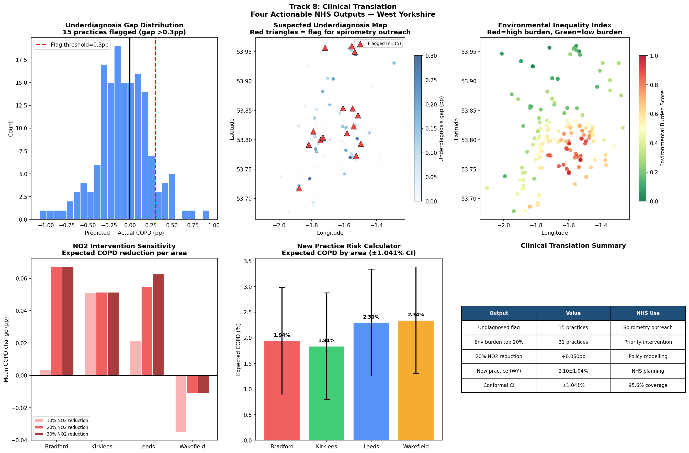

**Figure 18: SHAP-based NO2 sensitivity analysis showing feature importance ranking, NO2 SHAP contribution by area, and NO2 value vs SHAP relationship.**

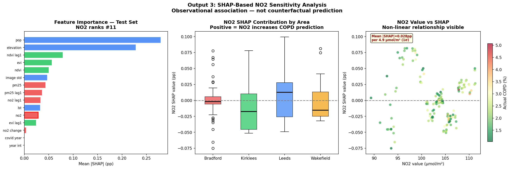

---

## Key Findings

**1. Satellite models generalise to unseen GP practices.**
The stacking ensemble achieved LOOCV R2=0.352 on practices held out entirely during training, demonstrating that satellite and environmental features carry sufficient signal to estimate COPD burden for practices with no prior health records.

**2. Satellite imagery adds genuine predictive value beyond scalar indices.**
The meta-learner assigned 37.5% weight to SatResNet image predictions, with a LOOCV improvement of delta R2=+0.073 over XGBoost tabular features alone. This confirms that the spatial texture of the urban environment, how roads, buildings, and green space are arranged, carries information not captured by NDVI and NO2 scalars.

**3. Tabular features outperform images for geographic generalisation.**
XGBoost LOOCV R2=0.279 exceeded SatResNet LOOCV R2=0.188, indicating that curated scalar summaries of environmental exposure generalise more reliably than raw image representations when training data is limited to 159 practices.

**4. Population density and elevation are the dominant predictors.**
SHAP importance of 0.280 and 0.229 respectively reflects structural geographic factors that determine decades of cumulative exposure. Low elevation concentrates vehicular pollution through valley trapping; population density captures urban morphology and the demographic composition of the registered population.

**5. The combined pollution signal is substantial despite NO2 ranking eleventh individually.**
Current NO2, lagged NO2, NO2 change, PM2.5, and PM2.5 lag together contribute 0.146 percentage points, the third largest feature group after sociodemographic and topographic factors. Leeds is the only NHS area where NO2 exerts a net positive SHAP contribution, consistent with its status as the highest-pollution area in the study region.

**6. Temporal R2=0.966 reflects stability not skill.**
Within-practice COPD standard deviation across five years is 0.124%, compared to between-practice standard deviation of 0.73%. The persistence baseline exploits this stability without learning anything about the environment, making temporal split an uninformative evaluation protocol for this application.

**7. LOO conformal prediction provides clinically honest uncertainty.**
95.6% empirical coverage with intervals of +/-1.041% meets the theoretical guarantee of at least 95% coverage. For a practice predicted at 2.30% COPD, the resulting interval of [1.26%, 3.34%] honestly represents the model's uncertainty at GP practice scale.

**8. GradCAM confirms mechanistically coherent spatial attention.**
For the five highest-COPD test practices, the image model concentrated attention on road networks, building clusters, and industrial infrastructure. For the five lowest-COPD practices, attention shifted to green space and agricultural land. This pattern was independently confirmed by occlusion sensitivity analysis.

**9. Leeds inner-city is the most environmentally burdened sub-region.**
Leeds achieved the highest composite burden score of 0.613, driven by the highest NO2 concentrations in the region at 106.4 umol/m2 and the lowest mean NDVI of 0.539. The top five most burdened individual practices all belong to Leeds inner-city, with seven of the top ten under-diagnosis flags also concentrated there.

**10. The Wakefield anomaly confirms a principled observational boundary.**
Wakefield shows the highest COPD prevalence at 2.34% despite high elevation and relatively high NDVI, attributable to a coal mining industrial legacy that persists in patient lung function decades after mine closure. Satellite imagery cannot detect historical occupational exposures, and Wakefield practices show the largest positive residuals in the study, a finding that is expected rather than a methodological failure.

**11. The COVID-19 lockdown validates the satellite extraction pipeline.**
A mean NO2 reduction of 8.2 umol/m2 was captured across all four NHS areas in 2020-21, independently confirmed by the satellite pipeline without input from health records. COPD registers showed minimal contemporaneous response, consistent with the multi-year latency of COPD pathogenesis.

**12. Fifteen practices flagged for potential under-diagnosis.**
Practices where predicted prevalence exceeded registered prevalence by more than 0.3 percentage points were flagged as candidates for spirometry outreach. Leeds accounted for seven of the top ten, with the largest gap at practice B86019 where actual prevalence was 1.07% against a predicted 2.01%.

---

## Limitations

**1. Dataset size.**
159 practices is a small training set for deep learning. The 5-fold practice split used for SatResNet approximates rather than replicates true leave-one-out cross-validation, with each fold training on approximately 127 practices. This likely suppresses SatResNet LOOCV R2 relative to its theoretical capacity with more data.

**2. Observational design.**
The pipeline characterises association structure rather than causal relationships. Counterfactual NO2 reduction scenarios were not reported as the model does not reliably extrapolate outside the training distribution. SHAP values describe how the model uses features, not how changing those features would affect real-world COPD outcomes.

**3. Unmeasured confounders.**
Several variables known to strongly predict COPD burden at practice level are unavailable without survey data. Smoking prevalence is the single strongest individual-level risk factor for COPD and is entirely absent from the feature set. Age structure, the proportion of patients aged 65 and above, is a powerful demographic predictor that correlates with both environmental exposure history and register prevalence. Occupational exposure history, particularly in mining and manufacturing communities, drives burden independently of current satellite-observable pollution. Healthcare access and diagnostic behaviour vary across practices and directly affect register completeness. The environmental signal extracted by UrbanLung reflects a partial view of the true causal structure.

**4. IMD exclusion.**
The Index of Multiple Deprivation was deliberately excluded to preserve a clean claim about the independent predictive value of satellite environmental data. Including IMD would likely improve LOOCV R2 but would confound the attribution of predictive signal to satellite observables, as IMD partially encodes environmental exposure, partially predicts health through socioeconomic pathways unrelated to environment, and contains a health deprivation and disability domain that already partially encodes respiratory morbidity. This exclusion is a methodological choice rather than an oversight, and the relationship between IMD and model residuals is reserved for future decomposition analysis.

**5. QOF register prevalence.**
The outcome variable reflects recorded rather than true biological COPD burden. A substantial proportion of patients coded with COPD may not meet spirometric criteria on re-testing, while genuine cases go unrecorded in others. Predictions should be interpreted as estimates of expected recorded burden rather than biological prevalence.

**6. RGB imagery only.**
Sentinel-2 provides 13 spectral bands including near-infrared and shortwave infrared, which carry information about vegetation health, soil moisture, and built-up surface materials not visible in RGB. This study used RGB patches only, consistent with the SENTINEL2_RGB_MOCO pre-training backbone. Adding NIR and SWIR bands would require retraining from a multispectral backbone and would likely address the semi-urban fringe failure case by providing clearer spectral separation between vegetated and built-up surfaces.

**7. Semi-urban fringe failure case.**
Practice B83626 in Bradford was identified as the primary model failure case through GradCAM analysis. Its ambiguous land-cover composition, mixing urban road networks with green space and low-density residential fabric, produces conflicting image signals that cause the model to over-predict by 0.47 percentage points. Practices at the semi-urban fringe where satellite texture does not clearly reflect the environmental exposure of the registered population may be systematically mispredicted.

**8. Wakefield and post-industrial communities.**
Satellite imagery cannot detect occupational or historical exposures. Practices serving communities where coal mining or heavy industry shaped patient lung health decades ago will be systematically under-predicted. Deployment in post-industrial areas should include explicit flagging of this limitation.

**9. Single geography.**
All 159 practices are located in West Yorkshire. The environmental relationships learnt by the model, including valley trapping, Pennine elevation gradients, and post-industrial community patterns, are specific to this geography. Whether the pipeline generalises to other NHS regions with different topographic, industrial, and demographic profiles remains an open question that requires evaluation on held-out regions rather than held-out practices.

**10. Deployed model assumption.**
The deployed model is trained on all 159 practices to maximise performance. LOOCV R2=0.352 provides the generalisation estimate for this architecture but does not constitute a held-out evaluation of the specific deployed weights. This is standard practice in supervised learning and is acknowledged here for transparency.

---

## Future Work

**1. Extend temporal horizon to 2006-2024.**
The full QOF time series is available from 2006, providing 18 years of practice-level COPD observations. Extending the dataset would enable long-range forecasting where the persistence baseline degrades substantially and satellite models provide greater relative utility. MODIS and Landsat provide continuous environmental coverage for the pre-Sentinel-5P period from 2006 to 2018.

**2. Add NIR and SWIR Sentinel-2 bands.**
Moving from RGB to multispectral imagery would allow detection of vegetation health stress, soil moisture, and industrial surface materials not visible in RGB. This directly addresses the semi-urban fringe failure case identified in B83626 Bradford and would require retraining from a multispectral backbone such as SENTINEL2_ALL_MOCO.

**3. Spatial NO2 image as an additional modality.**
Currently NO2 is represented as a scalar catchment mean. Sentinel-5P provides a full NO2 raster at 3.5 km resolution, capturing spatial gradients including valley floor concentration, road corridor hotspots, and industrial plume patterns that a scalar summary cannot encode. Treating NO2 as a spatial image and passing it through a separate CNN branch within the stacking framework would extend the multimodal approach to atmospheric chemistry data.

**4. Causal analysis using COVID-19 as a natural experiment.**
The lockdown-induced NO2 reduction of 8.2 umol/m2 in 2020-21 provides a natural experiment for quasi-experimental estimation of the pollution-COPD causal effect at GP practice scale. A difference-in-differences design using practices near major roads as the treatment group and rural practices as controls, with COPD register changes observed two to three years after the lockdown, would provide the first quasi-experimental evidence of the NO2-COPD relationship at practice resolution.

**5. Graph neural network for spatial practice relationships.**
None of the current models use spatial relationships between practices explicitly. Practices near high-COPD areas tend to have higher COPD themselves, reflecting shared environmental exposures and population mobility patterns. A graph neural network with practice proximity as edges and satellite environmental features as node attributes would capture this neighbourhood signal, representing a novel application of geometric deep learning to primary care health surveillance.

**6. Temporal transformer for year-to-year dynamics.**
The current models treat each practice-year observation independently. A temporal transformer operating on the five-year sequence per practice would learn which practices are trending upward, how COVID disruption propagates through registers over subsequent years, and whether lagged exposure relationships vary across the observation window. This is particularly relevant for the 2006-2024 extension where 18 time steps per practice would provide sufficient sequence length for meaningful temporal modelling.

**7. IMD decomposition study.**
Including the Index of Multiple Deprivation alongside satellite features in a decomposition framework would separate the environmental contribution from the socioeconomic contribution to practice-level COPD burden. This would directly address the confounding acknowledged in the limitations and strengthen the causal interpretation of the satellite signal.

**8. Generalisation to other NHS regions.**
Applying the pipeline to Greater Manchester, Sheffield, and rural NHS regions would test whether the environmental relationships learnt in West Yorkshire transfer across different topographic, industrial, and demographic profiles. A held-out region evaluation, training on West Yorkshire and predicting across Manchester, would provide a stronger generalisation claim than the practice-level LOOCV reported here.

**9. Integration of age structure and smoking prevalence.**
Linking ONS age structure data and regional smoking prevalence estimates to the practice-level feature set would address the two largest unmeasured confounders identified in the limitations. Even approximate smoking prevalence at local authority level would provide a meaningful partial control for the most important individual-level COPD risk factor.

**10. Extension to other respiratory conditions.**
The pipeline is condition-agnostic. Asthma, bronchiectasis, and heart failure all have QOF registers and similar environmental exposure relationships. Applying UrbanLung to these conditions with minimal modification would test the transferability of the framework and provide a broader evidence base for satellite-grounded primary care surveillance across England.

---

## References

Angelopoulos, A.N. and Bates, S. (2021). A gentle introduction to conformal prediction and distribution-free uncertainty quantification. arXiv:2107.07511.

Bibault, J.E., Bassenne, M., Ren, H., et al. (2020). Deep learning-based prediction of cancer prevalence from satellite images. npj Digital Medicine, 3(1), 135.

Chattopadhay, A., Sarkar, A., Howlader, P. and Balasubramanian, V.N. (2018). Grad-CAM++: Generalised gradient-based visual explanations for deep convolutional networks. IEEE WACV, 839-847.

Chen, R., Yin, P., Meng, X., et al. (2017). Fine particulate air pollution and daily mortality. American Journal of Respiratory and Critical Care Medicine, 196(1), 73-81.

Chen, T. and Guestrin, C. (2016). XGBoost: A scalable tree boosting system. ACM SIGKDD, 785-794.

Doiron, D., de Hoogh, K., Probst-Hensch, N., et al. (2019). Air pollution, lung function and COPD: results from the population-based UK Biobank study. European Respiratory Journal, 54(1), 1802140.

Drusch, M., Del Bello, U., Carlier, S., et al. (2012). Sentinel-2: ESA's optical high-resolution mission for GMES operational services. Remote Sensing of Environment, 120, 25-36.

European Respiratory Society (2013). European Lung White Book. Sheffield: ERS.

Jean, N., Burke, M., Xie, M., et al. (2016). Combining satellite imagery and machine learning to predict poverty. Science, 353(6301), 790-794.

Liu, Y., Pan, X., Li, W., et al. (2022). Predicting COPD prevalence from satellite environmental data: a multi-city study in China. Environmental Health Perspectives, 130(4).

Lundberg, S.M. and Lee, S.I. (2017). A unified approach to interpreting model predictions. NeurIPS, 30, 4765-4774.

Nacul, L., Soljak, M., Samarasundera, E., et al. (2011). COPD in England: a comparison of expected, model-estimated, and registered prevalence. Primary Care Respiratory Journal, 20(1), 46-53.

NHS Digital (2024). Quality and Outcomes Framework: Prevalence, achievements and exceptions data. Available at: digital.nhs.uk/qof.

NHS RightCare (2018). COPD Scenario: Achieving Earlier Diagnosis. NHS England.

Robinson, C., Hou, L., Malkin, K., et al. (2022). TorchGeo: Deep learning with geospatial data. ACM SIGSPATIAL, 1-12.

Selvaraju, R.R., Cogswell, M., Das, A., et al. (2017). Grad-CAM: Visual explanations from deep networks via gradient-based localisation. ICCV, 618-626.

Stewart, A.J., Robinson, C., Corley, I.A., et al. (2021). TorchGeo: Earth observation transfer learning. IGARSS, 1506-1509.

Tsao, T.M., Tsai, M.J., Hwang, J.S., et al. (2018). Health effects of a forest environment on lung function, inflammation, and stress hormones. Environmental Health and Preventive Medicine, 23(1), 1-11.

Vovk, V., Gammerman, A. and Shafer, G. (2005). Algorithmic Learning in a Random World. Springer, New York.

Wolpert, D.H. (1992). Stacked generalisation. Neural Networks, 5(2), 241-259.

Zanobetti, A. and Schwartz, J. (2009). The effect of fine and coarse particulate air pollution on mortality. Environmental Health Perspectives, 117(6), 898-903.

---

## Citation

If you use this work, please cite:

```
UrbanLung: COPD Prevalence Estimation from Google Satellite Imagery and NHS Records.
West Yorkshire NHS Practices, 2019-2024.
Navin Bondade, University of Bradford, 2026.
```

## Author

**Navin Bondade**
MSc Health Data Science, University College London
LinkedIn: linkedin.com/in/navin-bondade
GitHub: github.com/navinbondade
